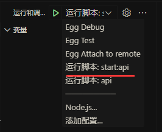

# 藏网阁

## @itrumor/api 环境配置和开发调试

### 配置环境
- 安装 `PostgreSQL`
- 安装 `redis`
- 本地配置需`config.local.ts` 和 生产需配置 `config.prod.ts` 配置 `config.default.ts` 里面没有配置的

## 本地开发

### vscode 开发调试


### 初始化数据库

```bash
// 进入apps/api目录
npx sequelize db:migrate
```

## 生产发布

### 初始化数据库

```bash
// 进入apps/api目录
npx sequelize db:migrate --env production or yarn db-prod
```

### ts 编译成 js，不然会报错

```bash
yarn ci
```

### 启动

```bash
yarn start
```

### 关闭

```bash
yarn stop
```
